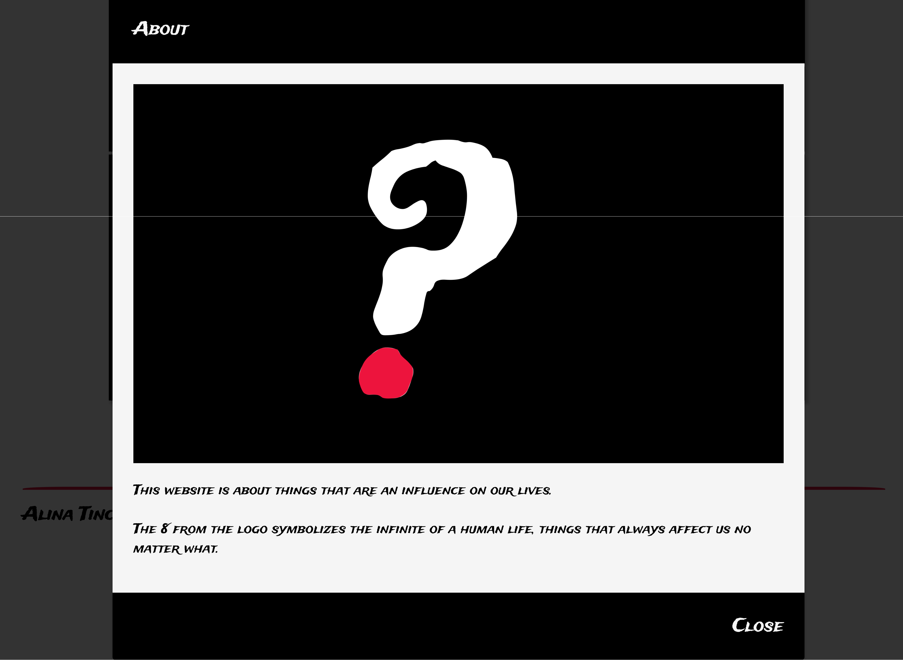

# life
This is a small responsive website made with HTML, CSS + CSS Grid. It is a website made with the purpose to learn how to make a responsive grid with a read more- modal, made with CSS grid.

The Images folder contains the images which I created myself in Adobe Illustrator (the AI file is inside there as well) based on real images which are in another folder inside the images folder called Grid.

This is a screenshot of the website: 

And this is a screenshot of the modal, after clicking on read more text: 

